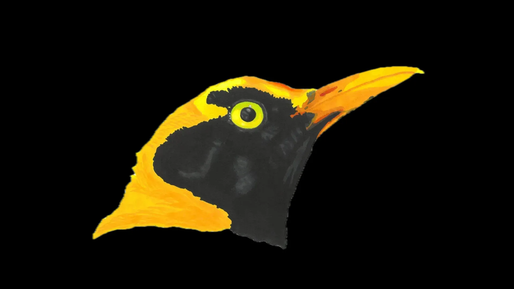

# Bowerbird

Bowerbird is a WordPress plugin update install tool. It queries a Jira API to find and simplify the process of updating WordPress plugins, while still tracking them via Jira tickets. Meant for an environment where strict version control is needed. Named after an industrious creature who excels at building.



## 📚 Prerequisites

Googles' [Go language](https://go.dev) installed to enable building executables from source code.

An selection of `json` files to enable authorized Jira API querying, and everything needed to push plugin update files to a repository (see `jsons` folder for reference).

## 🔩 Function

Bowerbird searches the targeted Jira API for tickets marked as **"New"** (aka ToDo), with a summary containing the `wordpress-plugin` vendor tag. It then gathers the qualifying candidates and runs a series of `composer require` commands on the ***composer.json*** file and pushes the updates to a designated branch.

## 📂 Project Structure

Inside of your Bowerbird project, you'll see the following folders and files:

``` zsh
.
├── jsons/
│   ├── definitions.json
│   ├── jira.json
│   ├── tokens.json
├── bowerbird.webp
├── go.mod
├── Jenkisfile
├── LICENSE.md
├── main.go
├── packagist.go
├── README.md
├── shared.go
└── vars.go
```

## 🚧 Build

Before building the application, change the value of the `resources` constant to reflect your environment:

``` go
resources string = "/data/automation/resources/"
```

Then, from the root folder containing `main.go`, use the command that matches your environment:

### Windows & Mac:

``` zsh
go build -o [name] .
```

### Linux:

``` zsh
GOOS=linux GOARCH=amd64 go build -o [name] .
```

## 🏃 Run

``` zsh
bowerbird -r
```

## 🎏 Available Flags

| Command               | Action                      |
|:----------------------|:----------------------------|
|    `-h, --help`       |   Help information          |
|    `-r, --run`        |   Run program               |
|    `-v, --version`    |   Display program version   |

## 🎫 License

Code is distributed under [The Unlicense](https://github.com/farghul/bowerbird/blob/main/LICENSE.md) and is part of the Public Domain.